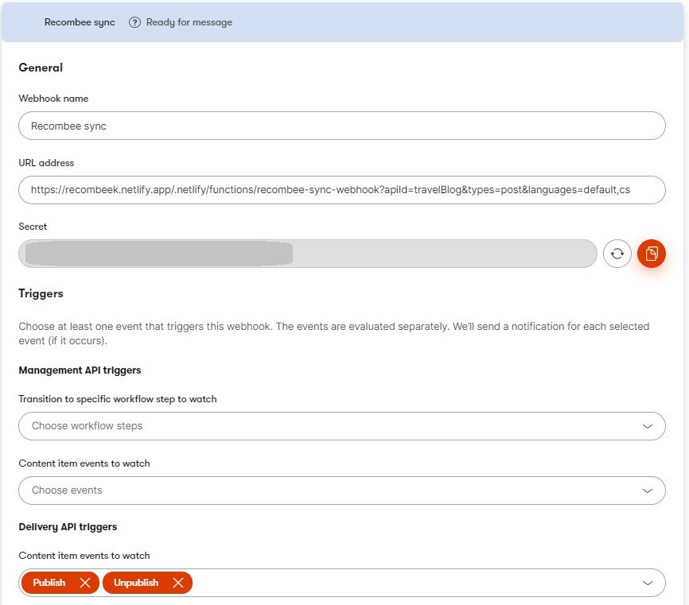
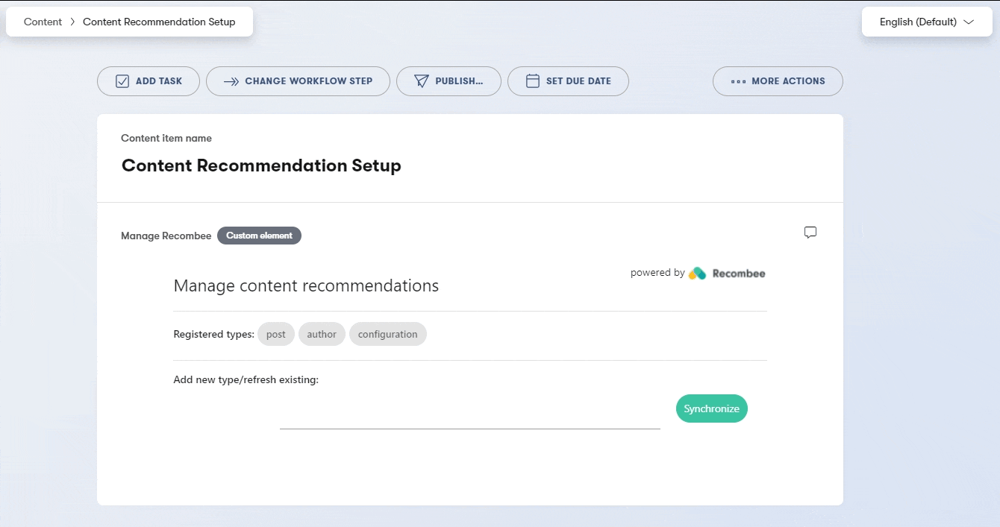
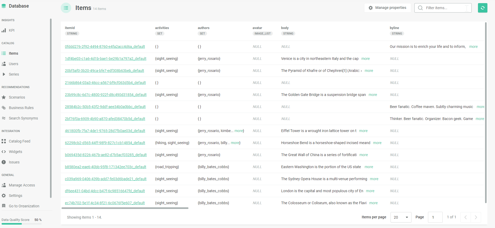
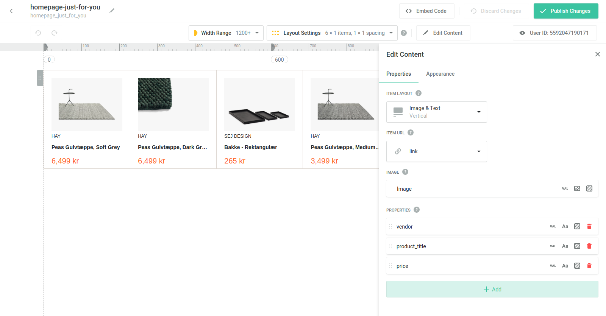

[![Core integration][core-shield]](https://kontent.ai/integrations/recombee)

![Last modified][last-commit]
[![Issues][issues-shield]][issues-url]
[![Contributors][contributors-shield]][contributors-url]
[![Forks][forks-shield]][forks-url]
[![MIT License][license-shield]][license-url]

[![Stack Overflow][stack-shield]](https://stackoverflow.com/tags/kontent-ai)
[![Discord][discord-shield]](https://discord.gg/SKCxwPtevJ)

<p align="center">
<picture>
  <source media="(prefers-color-scheme: dark)" srcset="docs/kai-logo-hor-neg-rgb.svg">
  
</picture>
<image src="docs/recombee-logo.png" alt="recombee logo" width="400" style="vertical-align: middle;">
</p>

<p align="center">
  <a href="#demo">Demo</a> •
  <a href="#prerequisities">Prerequisities</a> •
  <a href="#get-started">Get started</a> •
  <a href="#recombee-data-structure">Recombee data structure</a> •
  <a href="#getting-recommendations">Getting recommendations</a> •
  <a href="#deleting-archived-or-unpublished-items">Deleting items</a> •
  <a href="#developing">Developing</a> •
  <a href="#contributors">Contributors</a> •
  <a href="#license">License</a> •
  <a href="#additional-resources">Resources</a>
</p>

This repository contains an _example implementation_ of integration between [Recombee](https://www.recombee.com/) AI-powered content personalization and recommendation engine, and [Kontent.ai](https://kontent.ai/) headless CMS. It comes with an optional [custom element](https://kontent.ai/learn/tutorials/develop-apps/integrate/content-editing-extensions) for indexing your content in Recombee, as well as **two** [Netlify functions](https://docs.netlify.com/functions/overview/) for the **initial setup** and subsequent **processing of content changes** via a [webhook](https://kontent.ai/learn/tutorials/develop-apps/integrate/webhooks).


## Demo


## Prerequisities
To run this integration, you'll need a Kontent.ai project + a [Recombee account](https://account.recombee.com/users/sign_up). 

**[Contact Recombee](mailto:business@recombee.com) to recieve a special offer for Kontent.ai customers!**

## Get Started

1. ### Quick Deploy
    Netlify has made this easy. If you click the deploy button below, it will guide you through the process of deploying it to Netlify and leave you with a copy of the repository in your account as well.

    [](https://app.netlify.com/start/deploy?repository=https://github.com/kontent-ai/integration-example-recombee)

    After you deploy the project into Netlify, you'll find two functions there:
    1. **recombee-init-function** is the function that imports or refreshes all content of selected content type from Kontent.ai into Recombee.
    2. **recombee-sync-webhook** is the function you want to call via a webhook from Kontent.ai to notify the integration that there's been a change to your content and that Recombee database has to be potentialy updated.

2. ### Get your credentials from Recombee
   In order for the integration to work, you'll need a set of credentials for Recombee. In order to obtain those, just login into your Recombee account, select your database and you'll want to copy the **API Identifier** and **Private token** that can be found under the **Settings** section. These credentials will be neccessary for the following steps. 

  

3. ### Create a new Webhook in Kontent.ai to Sync your data with Recombee
    The next step is [creating a new webhook in Kontent.ai](https://kontent.ai/learn/tutorials/develop-apps/integrate/webhooks#a-create-a-webhook). 

    Fill out the following into the webhook's **URL address** field:

    `https://<YOUR_NETLIFY_APP>/.netlify/functions/recombee-sync-webhook?apiId=`(**Recombee API Identifier**)`&types=`(**Kontent.ai content types to be processed by the webhook**)`&languages=`(**Kontent.ai languages to be processed by the webhook**)

    You can include multiple Kontent.ai types and languages the webhook will be looking out for and synchronizing - to do so, just include them as a comma-separated list.

    Subsequently, set the Kontent.ai **Delivery API triggers** to watch for _Publish_ and _Unpublish_ of your content items. 

    At the end, this is an example of how your webhook might look like:

    

    Save the webhook and copy the generated **secret** as it would be required as a parameter in the following step.


4. ### Configure your Netlify functions

    To **setup** both function, all you need to do is set the following **[environment variables](https://docs.netlify.com/configure-builds/environment-variables/)** for your Netlify site. 
    You can find our tutorial on configuring Netlify functions [here](https://github.com/kontent-ai/netlify-webhook-processor#configuring-the-netlify-function).

    Variable | Value |
    --- | --- |
    RECOMBEE_API_KEY |  your [Recombee private token](https://docs.recombee.com/authentication.html) | 
    KONTENT_SECRET | your [Kontent.ai webhook secret](https://kontent.ai/learn/tutorials/develop-apps/integrate/webhooks#a-validate-received-notifications)

    The Recombee private key is used by the function to synchronize your recommendation database.

    The Kontent.ai webhook secret is used to ensure integrity of the webhook payload. It has been created in the previous step.

    After your function has been **redeployed** (or your environment variables has been propagated), the functions are ready to be called. 
    
    You can observe the real-time **Function log** on the same screen you'd find your function's endpoint (_Functions_ -> _your function_). 
  

5. ### Register a content type into your Recombee database
    The initialization of your Recombee recommendation database with your content is done through the **recombee-init-function**. Simply make a POST request towards the function's endpoint URL (`https://<YOUR_NETLIFY_APP>/.netlify/functions/recombee-init-function`) with the following payload:

    ```
    {
      "projectId":"{Kontent.ai project ID}",
      "language":"{Kontent.ai language codename}",
      "contentType":"{Kontent.ai content type codename}",
      "recombeeApiId":"{Recombee's API Id}",
    }
    ```
    The function processes all **published** content of the given content type and language from your project and creates or updates your recommendation database in Recombee. 

    _Please keep in mind, that this example integration does not fully support modular content, i.e. it only includes codenames of linked items, not the whole content structure and subsequent links as it makes sense to choose mostly flat types for recommendations (i.e. articles, blogposts, ...)._

    ### Alternatively use a **custom element** to manage your registered content types

    Simply add a new [custom element]((https://kontent.ai/learn/tutorials/develop-apps/integrate/content-editing-extensions)) into your content model (it will be a good idea to create some kind of _meta_ content type to store some of the project's settings, including this element). 

    Use your netlify's URL for the base page as the **Hosted code URL** and a following settings to setup the custom element:

    ```
    {
      "recombeeApiId": "{Recombee's API Id}"
    }
    ```
    The custom element allows you to (re)register your content types into your Recombee database. It also saves codenames of types you have already registered through it. <a href="#demo">**Check out the demo gif above!**</a> All of your content model properties (including images) will be modeled and transfered into the recommendation database.
    
    If you are working with content in [multiple language variants](https://kontent.ai/learn/tutorials/write-and-collaborate/create-multilingual-content/translate-content-items), adding additional variants to Recombee is just as easy as simply switching to the desired language variant and registering the content type through a custom element included in that variant (see gif below).

    

    _Please note, that the element actually stores the types that have been registered in Recombee as its value, so if you use it in multiple places, it might not display the registered content types correctly._

## Recombee data structure
In order to process data from Kontent.ai and save them into Recombee, the functions map your elements from Kontent.ai directly into Recombee under the same name. The linked items are saved as a set (array) of codenames. Every item will also have **codename**, **type**, **language**, **collection**, and **last_modified** properties on top of the specific elements. Knowing the structure of your data will allow you to use the full potential of [Recombee's filtering and boosting features](https://docs.recombee.com/reql.html). You can also sync multiple content types with one Recombee database. 

If you need help with your use-case, feel free to contact us on our [Discord](https://discord.gg/SKCxwPtevJ), or reach out to [Recombee directly](mailto:business@recombee.com).   



## Sending interactions and recieving recommendations
Now that you have your recombee database populated with your content, it's time to start sending content interactions into Recombee. The recommendation engine works with provided information about your content, as well as with how your visitor interact with said content. You can send multiple different types of user-content interactions (simple view, purchase, ...). To learn more check out the [Recombee documentation on interactions](https://docs.recombee.com/gettingstarted.html#send-interactions).

There are also multiple ways to get recommendations for your website once you are all setup. The most simple and streight forward is using the Recombee widget that you can create directly from the Recombee's UI. Once you set it up, you'll recieve a generated HTML code that you can just plug into your website and you are good to go (it also automatically tracks and sends view interactions back into Recombee). 
For more please refer to [Recombee documentation on getting recommendations](https://docs.recombee.com/gettingstarted.html#get-recommendations).



## Deleting archived or unpublished items
Sometimes a content item has to be archived, or unpublished. Once this item becomes unavailable, it should be also *removed* from the recommendation engine so your recommendations are always valid. This integration, by default, removes unpublished and archived items from your recombee database, however, by doing this it also removes all of the previous item interactions that are being used to construct your recommendation model. To avoid this, Recombee suggests creating a dedicated model property that will be used to determine if the item is valid or invalid. You'll then need to use this property to request only valid recommendations. Read more about this topic in [Recombee's documentation](https://docs.recombee.com/reql_filtering_and_boosting.html#handling-deleted-items).


## Developing
[Netlify Dev](https://www.netlify.com/products/dev/) is highly recommended for local development. 

```bash
# Initial project setup
$ npm install

# Run locally
$ netlify dev
```

The custom element is created with [Create React App](https://create-react-app.dev/).

## Contributors
We have collected notes on how to contribute to this project in [CONTRIBUTING.md](CONTRIBUTING.md).

<a href="https://github.com/kontent-ai/integration-example-recombee/graphs/contributors">
  
</a>

## License

[MIT](https://tldrlegal.com/license/mit-license)

## Additional Resources

- [Kontent.ai Integration documentation](https://kontent.ai/learn/tutorials/develop-apps/integrate/integrations-overview)


[last-commit]: https://img.shields.io/github/last-commit/kontent-ai/integration-example-recombee?style=for-the-badge
[contributors-shield]: https://img.shields.io/github/contributors/kontent-ai/integration-example-recombee.svg?style=for-the-badge
[contributors-url]: https://github.com/kontent-ai/integration-example-recombee/graphs/contributors
[forks-shield]: https://img.shields.io/github/forks/kontent-ai/integration-example-recombee.svg?style=for-the-badge
[forks-url]: https://github.com/kontent-ai/integration-example-recombee/network/members
[stars-shield]: https://img.shields.io/github/stars/kontent-ai/integration-example-recombee.svg?style=for-the-badge
[stars-url]: https://github.com/kontent-ai/integration-example-recombee/stargazers
[issues-shield]: https://img.shields.io/github/issues/kontent-ai/integration-example-recombee.svg?style=for-the-badge
[issues-url]: https://github.com/kontent-ai/integration-example-recombee/issues
[license-shield]: https://img.shields.io/github/license/kontent-ai/integration-example-recombee.svg?style=for-the-badge
[license-url]: https://github.com/kontent-ai/integration-example-recombee/blob/main/LICENSE
[core-shield]: https://img.shields.io/static/v1?label=&message=core%20integration&style=for-the-badge&color=FF5733
[stack-shield]: https://img.shields.io/badge/Stack%20Overflow-ASK%20NOW-FE7A16.svg?logo=stackoverflow&logoColor=white&style=for-the-badge
[discord-shield]: https://img.shields.io/discord/821885171984891914?label=Discord&logo=Discord&logoColor=white&style=for-the-badge
